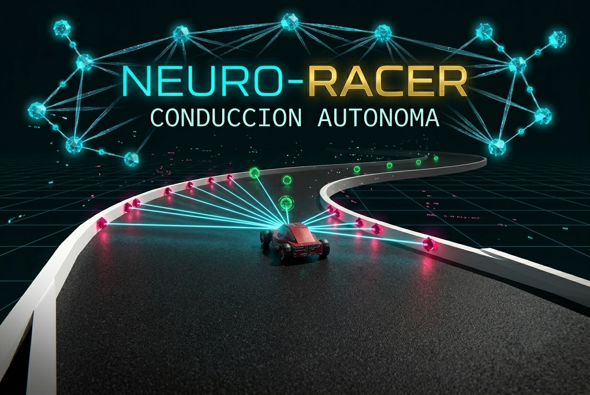

# Neuro-Racer

> Simulador 2D de autos autonomos con IA evolutiva, construido en Python + Pygame.


Neuro-Racer entrena una poblacion de vehiculos para aprender a completar pistas de forma autonoma. Cada auto usa una red neuronal simple con sensores tipo raycast, y la siguiente generacion nace por seleccion del mejor agente con mutaciones.

## Demo Visual



## Caracteristicas

- IA basada en red neuronal ligera (5 entradas -> 2 salidas)
- Entrenamiento evolutivo por generaciones con mutacion
- 3 pistas incluidas: Ovalo de Alta Velocidad, Circuito en S, El Sacacorchos (Chicana)
- Sensores visuales del auto lider en tiempo real
- Musica de fondo y efectos de sonido
- Guardado/carga de mejor modelo (`mejor_modelo.pickle`)
- Control de velocidad de simulacion y pausa

## Como Funciona

1. Cada auto mide distancia al muro en 5 direcciones usando raycast.
2. Esas distancias alimentan una red neuronal que decide acelerar y girar.
3. El fitness aumenta al avanzar y, sobre todo, al cruzar checkpoints.
4. Cuando toda la poblacion muere, se crea una nueva generacion con elitismo y mutaciones.

## Requisitos

- Python 3.9 o superior
- `pygame`

## Instalacion

```bash
# 1) Clona el repositorio
git clone <URL_DEL_REPO>
cd neuro-racer

# 2) (Opcional pero recomendado) crea un entorno virtual
python3 -m venv .venv
source .venv/bin/activate

# 3) Instala dependencias
pip install pygame
```

## Ejecucion

```bash
python3 main.py
```

## Controles

### Menus

- `ENTER`: continuar desde pantalla de presentacion
- `1`: nueva poblacion
- `2`: cargar mejor modelo guardado (si existe)
- `3`: borrar modelo guardado
- `4`: mostrar/ocultar instrucciones
- `ESC`: salir o volver

### Simulacion

- `F`: alternar velocidad (60 FPS / 300 FPS)
- `P`: pausar/reanudar
- `G`: guardar mejor modelo actual
- `ESC`: volver al menu principal

## Estructura del Proyecto

```text
neuro-racer/
|-- main.py           # Punto de entrada
|-- simulation.py     # Estado del juego, menus y ciclo principal
|-- car.py            # Logica del vehiculo, sensores y colisiones
|-- brain.py          # Red neuronal y mutacion
|-- config.py         # Pistas, colores y configuracion global
|-- sounds/           # Musica y efectos de sonido
|-- splashscreen.png
|-- background_menu.png
|-- car.png
```

## Persistencia de Modelos

- Archivo principal usado por la app: `mejor_modelo.pickle`
- Se guarda un diccionario con `brain` y `fitness`

Si no existe archivo, la simulacion arranca desde cero automaticamente.

## Ideas para Mejorarlo

- Exportar metricas por generacion a CSV
- Anadir mas sensores o capas ocultas en la red
- Incorporar crossover real entre dos campeones
- Visualizar graficas de fitness en vivo
- Crear modo watch para ver solo al mejor modelo

## Atribuciones de Audio

Special thanks to:

Sound Effect by <a href="https://pixabay.com/users/freesound_community-46691455/?utm_source=link-attribution&utm_medium=referral&utm_campaign=music&utm_content=68698">freesound_community</a> from <a href="https://pixabay.com/sound-effects//?utm_source=link-attribution&utm_medium=referral&utm_campaign=music&utm_content=68698">Pixabay</a>

Sound Effect by <a href="https://pixabay.com/users/make_more_sound-35032787/?utm_source=link-attribution&utm_medium=referral&utm_campaign=music&utm_content=145007">Jesse Grum</a> from <a href="https://pixabay.com/sound-effects//?utm_source=link-attribution&utm_medium=referral&utm_campaign=music&utm_content=145007">Pixabay</a>

Sound Effect by <a href="https://pixabay.com/users/lolo_s-54380120/?utm_source=link-attribution&utm_medium=referral&utm_campaign=music&utm_content=474092">Lolo_s</a> from <a href="https://pixabay.com//?utm_source=link-attribution&utm_medium=referral&utm_campaign=music&utm_content=474092">Pixabay</a>

Sound Effect by <a href="https://pixabay.com/users/soundreality-31074404/?utm_source=link-attribution&utm_medium=referral&utm_campaign=music&utm_content=151963">Jurij</a> from <a href="https://pixabay.com//?utm_source=link-attribution&utm_medium=referral&utm_campaign=music&utm_content=151963">Pixabay</a>

Sound Effect by <a href="https://pixabay.com/users/transcendedlifting-30596364/?utm_source=link-attribution&utm_medium=referral&utm_campaign=music&utm_content=125125">transcendedlifting</a> from <a href="https://pixabay.com//?utm_source=link-attribution&utm_medium=referral&utm_campaign=music&utm_content=125125">Pixabay</a>

Sound Effect by <a href="https://pixabay.com/users/astonmartinvantagev12-49288110/?utm_source=link-attribution&utm_medium=referral&utm_campaign=music&utm_content=360529">AstonMartinVantageV12</a> from <a href="https://pixabay.com//?utm_source=link-attribution&utm_medium=referral&utm_campaign=music&utm_content=360529">Pixabay</a>

Sound Effect by <a href="https://pixabay.com/users/wings_of_freedom-47109921/?utm_source=link-attribution&utm_medium=referral&utm_campaign=music&utm_content=430459">tran tran</a> from <a href="https://pixabay.com//?utm_source=link-attribution&utm_medium=referral&utm_campaign=music&utm_content=430459">Pixabay</a>

Sound Effect by <a href="https://pixabay.com/users/soundreality-31074404/?utm_source=link-attribution&utm_medium=referral&utm_campaign=music&utm_content=232908">Jurij</a> from <a href="https://pixabay.com/sound-effects//?utm_source=link-attribution&utm_medium=referral&utm_campaign=music&utm_content=232908">Pixabay</a>

Sound Effect by <a href="https://pixabay.com/users/cryptionax-44225054/?utm_source=link-attribution&utm_medium=referral&utm_campaign=music&utm_content=314707">Rahul Vaghela</a> from <a href="https://pixabay.com/sound-effects//?utm_source=link-attribution&utm_medium=referral&utm_campaign=music&utm_content=314707">Pixabay</a>

Sound Effect by <a href="https://pixabay.com/users/dragon-studio-38165424/?utm_source=link-attribution&utm_medium=referral&utm_campaign=music&utm_content=376881">DRAGON-STUDIO</a> from <a href="https://pixabay.com/sound-effects//?utm_source=link-attribution&utm_medium=referral&utm_campaign=music&utm_content=376881">Pixabay</a>
